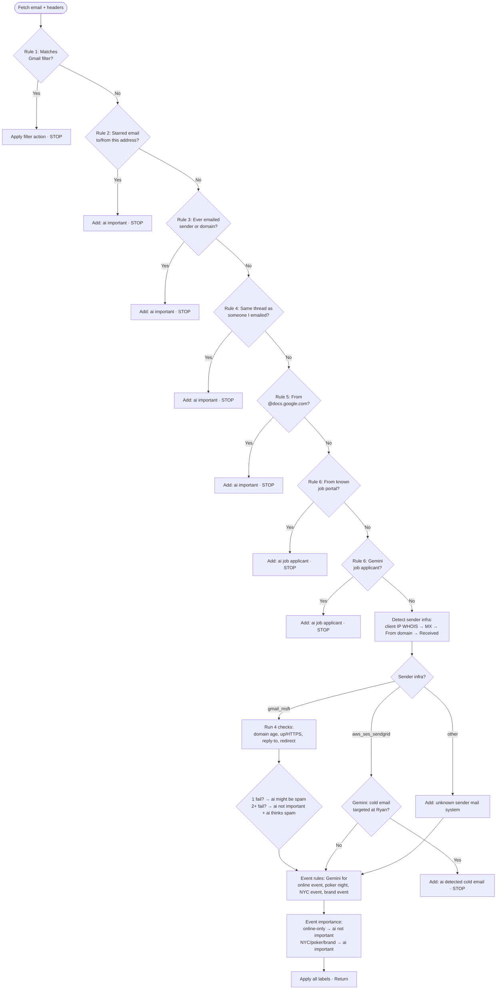

# Ryan Rules – Email Processing Flow

Flow for `processEmailWithRyanRules()` in `scripts/run-ryan-rules.ts`.  
Each rule can **apply labels** and **stop** (return), or **continue** to the next step.

---

## Mermaid flowchart

---

## Simplified linear outline

| Step | Rule / block | Condition | Action | Stop? |
|------|----------------|-----------|--------|-------|
| 1 | Rule 1 | Matches any Gmail filter (criteria + action) | Apply filter addLabelIds/removeLabelIds | Yes |
| 2 | Rule 2 | Starred any email to or from this address? | Add **ai important** | Yes |
| 3 | Rule 3 | Ever emailed sender or their domain? | Add **ai important** | Yes |
| 4 | Rule 4 | Same thread as someone I've emailed? | Add **ai important** | Yes |
| 5 | Rule 5 | From @docs.google.com? | Add **ai important** | Yes |
| 6 | Rule 6 | From known job portal (symplicity.com, csm.symplicity.com)? | Add **ai job applicant** | Yes |
| 6 | Rule 6 | Gemini: job applicant? | Add **ai job applicant** | Yes |
| 7 | Sender infra | Detect via: client IP WHOIS → MX → From domain → Received | — | No |
| 8 | gmail_msft | 4 checks (domain age &lt;2mo, domain up/HTTPS, reply-to same as from, no redirect) | 1 fail → **ai might be spam**; 2+ fail → **ai not important** + **ai thinks spam** | No |
| 8 | aws_ses_sendgrid | Gemini: cold email targeted at Ryan? | Add **ai detected cold email** | Yes |
| 8 | other | — | Add **unknown sender mail system** | No |
| 9 | Event rules | Gemini: online event, poker night, NYC event, brand event | Add matching event labels | No |
| 10 | Event importance | online event only (no NYC) | Add **ai not important** | No |
| 10 | Event importance | NYC / poker / brand event | Add **ai important** | No |
| 11 | — | — | Apply all collected labels | — |

---

## Sender infra detection order

1. **Client IP** from headers (e.g. `client-ip=` in Received-SPF / Authentication-Results) → WHOIS IP → map OrgName/NetName to gmail_msft / aws_ses_sendgrid.
2. **MX lookup** on From domain → `categorizeSMTPProvider` → gmail/msft/work-email → gmail_msft, automation → aws_ses_sendgrid.
3. **From domain** in known list (amazonses.com, sendgrid.net, mailgun.org, mailgun.com, sendersrv.com) → aws_ses_sendgrid.
4. **First Received** header “from” clause patterns → gmail_msft or aws_ses_sendgrid.
5. Otherwise → **other**.

---

## Gmail/MSFT 4 checks (when sender infra = gmail_msft)

1. **Domain not recently registered** — registered &lt; 2 months = fail.
2. **Domain up (HTTPS)** — checkDomainStatus (domain reachable, HTTPS).
3. **Reply-To same as From** — reply-to differs from From = fail.
4. **Domain is up and does not redirect** — fetch https://domain redirect:manual; 200 = pass, ≥300 = fail.

---

*Generated from `scripts/run-ryan-rules.ts`.*
