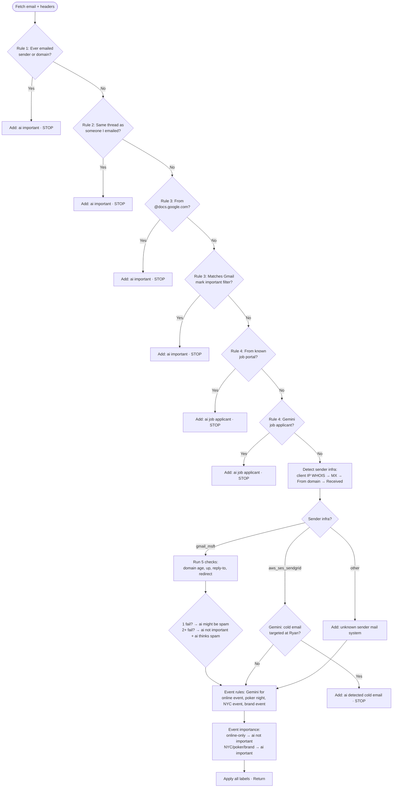

# Ryan Rules – Email Processing Flow

Flow for `processEmailWithRyanRules()` in `scripts/run-ryan-rules.ts`.  
Each rule can **apply labels** and **stop** (return), or **continue** to the next step.

---

## Mermaid flowchart

---

## Simplified linear outline

| Step | Rule / block | Condition | Action | Stop? |
|------|----------------|-----------|--------|-------|
| 1 | Rule 1 | Ever emailed sender or their domain? | Add **ai important** | Yes |
| 2 | Rule 2 | Same thread as someone I’ve emailed? | Add **ai important** | Yes |
| 3 | Rule 3 | From @docs.google.com? | Add **ai important** | Yes |
| 3 | Rule 3 | Matches a Gmail filter that marks as important? | Add **ai important** | Yes |
| 4 | Rule 4 | From known job portal (e.g. symplicity.com)? | Add **ai job applicant** | Yes |
| 4 | Rule 4 | Gemini: job applicant? | Add **ai job applicant** | Yes |
| 5 | Sender infra | Detect via: client IP WHOIS → MX → From domain → Received | — | No |
| 6 | gmail_msft | 5 checks (domain age &lt;2mo, domain up, reply-to ≠ from, redirect) | 1 fail → **ai might be spam**; 2+ fail → **ai not important** + **ai thinks spam** | No |
| 6 | aws_ses_sendgrid | Gemini: cold email targeted at Ryan? | Add **ai detected cold email** | Yes |
| 6 | other | — | Add **unknown sender mail system** | No |
| 7 | Event rules | Gemini: online event, poker night, NYC event, brand event | Add matching event labels | No |
| 8 | Event importance | online event only | Add **ai not important** | No |
| 8 | Event importance | NYC / poker / brand event | Add **ai important** | No |
| 9 | — | — | Apply all collected labels | — |

---

## Sender infra detection order

1. **Client IP** from headers (e.g. `client-ip=` in Received-SPF / Authentication-Results) → WHOIS IP → map OrgName/NetName to gmail_msft / aws_ses_sendgrid.
2. **MX lookup** on From domain → `categorizeSMTPProvider` → gmail/msft → gmail_msft, automation → aws_ses_sendgrid.
3. **From domain** in known list (amazonses.com, sendgrid.net, mailgun.org, mailgun.com) → aws_ses_sendgrid.
4. **First Received** header “from” clause patterns → gmail_msft or aws_ses_sendgrid.
5. Otherwise → **other**.

---

*Generated from `scripts/run-ryan-rules.ts`.*
